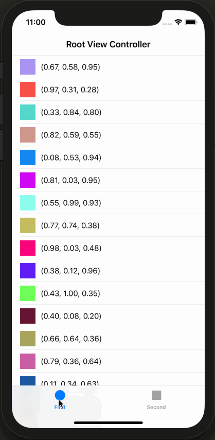

# UITabBarRefresh

[]()
[]()
[]()
[]()

UTTabBar 点击刷新

## 环境要求

- iOS8.0+
- Xcode10.0+

## 特性

- 简单易用，只要设置 UITabBarItem 的 `refreshBlock` 属性即可启用刷新功能
- 支持刷新动画(默认关闭动画)，默认动画是 `UIActivityIndicatorView`
- 支持自定义刷新动画，遵守 `XPTabBarRefreshViewAnimating` 协议并设置 `refreshView` 属性即可

## GIF演示



## 使用示例

1、将 `UITabBar+XPTabBarRefresh.{h/m}` 文件拖入项目

2、示例代码

```ObjC
// 根据项目实际场景获取UITabBarItem
UITabBarItem *tabBarItem =  self.tabBarItem; //self.navigationController.tabBarItem;
// 启用刷新动画
tabBarItem.enabledRefreshAnimation = YES;
// 自定义动画
tabBarItem.refreshView = [[CustomRefreshView alloc] init];
// 监听刷新回调
[tabBarItem setRefreshBlock:^(UITabBar *tabBar, UITabBarItem *tabBarItem) {
    // 发送网络请求刷新数据
    NSLog(@"Refresh");
    // 当网络请求完毕时记得调用 `stopRefresh` 方法
    dispatch_after(dispatch_time(DISPATCH_TIME_NOW, (int64_t)(3 * NSEC_PER_SEC)), dispatch_get_main_queue(), ^{
       [tabBarItem stopRefresh];
    });
}];
```

## 协议

被许可在 MIT 协议下使用，查阅LICENSE文件来获得更多信息。
